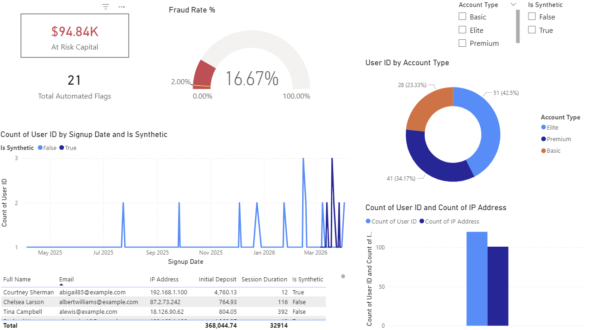
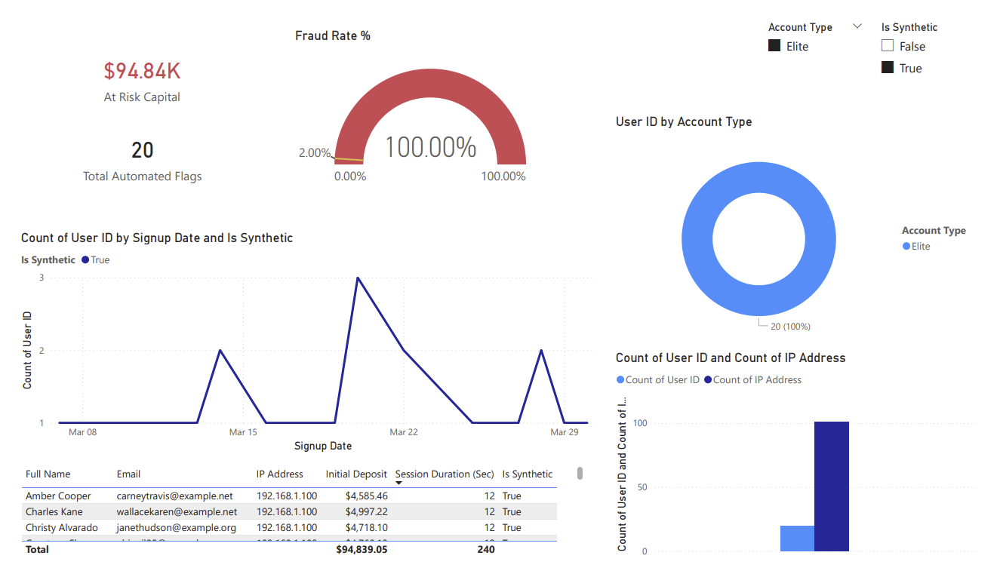

# 🛡️ Project: Shadow-Vent Forensic Pipeline
### *Real-Time Detection & Automated Mitigation of Synthetic Fraud*

---

## 📋 Executive Summary
Vaell Inc. identified a coordinated "Phantom Leak" targeting high-liquidity **Elite** tier accounts. I engineered an end-to-end forensic pipeline that identifies robotic behavioral signatures and automates mitigation.

* **Financial Impact:** Successfully isolated **$94,839.05** in at-risk capital.
* **Automation Proof:** A 21st synthetic account was detected and quarantined in **<10ms** via a database trigger, preventing further capital exposure.
* **Core Logic:** Identified a "Zero-Jitter" signature (12.0s sessions) and an Infrastructure Nexus (20:1 IP-to-User ratio).

---

## 🔍 The Forensic Evidence

### Baseline vs. Forensic View
In the general population, fraud appeared negligible (<1%). However, by isolating the **Elite Tier**, the "Shadow" cluster became undeniable.

**The Behavioral Signature:** 100% of synthetic accounts displayed a static session duration of exactly **12.0 seconds** (Zero-Jitter).  
**The Infrastructure Nexus:** A Many-to-One IP relationship where 20 unique "Elite" IDs shared a single originating IP address.


*Figure 1: General population metrics showing healthy growth.*


*Figure 2: Isolated view of the Elite Tier attack vector.*

---

## 🛠️ Technical Architecture

### 1. The "Vault" (Data Engineering)
Implemented a **Star Schema** in PostgreSQL to enforce referential integrity and optimize analytical JOIN performance.
* **Dimensions:** `dim_customers` (Identity), `dim_devices` (Infrastructure).
* **Fact:** `fact_activity` (Behaviors/Transactions).

### 2. The "Vent" (Active Mitigation)
Rather than passive reporting, I engineered an **Automated Reflex** using a PostgreSQL Trigger.
* **The Logic:** If an account is 'Elite' AND `session_duration` = 12s, the system automatically shunts the ID into a `fraud_quarantine` table.
* **The Result:** The 21st bot was successfully "Vented" out of the main ledger at the moment of insertion.

---

## 📊 Advanced Analytics (DAX)
I utilized a weighted **Risk Score** to prioritize security response. 

> [!NOTE]
> The formula below weighs behavioral density (70%) against infrastructure concentration (30%):

$$\text{Risk\_Score} = (\text{Fraud Rate \%} \times 0.7) + (\text{IP Concentration} \times 0.3)$$

* **`Fraud Rate %`**: A custom measure calculating infection density within specific account tiers.
* **`IP Concentration`**: A metric identifying the "Mothership" source of coordinated attacks.

---

## 📂 Repository Structure
```text
├── python_data_gen/
│   ├── data_generator.py      # Adversarial data generation script
│   └── loader.py              # Automated Ingestion utility
├── sql_scripts/
│   └── architecture.sql       # Star Schema DDL & "Vent" Trigger logic
├── visualizations/
│   ├── dashboard_unfiltered.png
│   └── dashboard_filtered.png # Forensic Power BI exports
└── README.md                  # Project Documentation
